**DOMAIN NAME SYSTEM**.

1.  Giới thiệu về hệ thống DNS

    1.  Định nghĩa DNS

        Trong hệ thống mạng, máy tính không sử dụng tên như con người mà
        sử dụng số. Cách mà các máy tính và các thiết bị tương đương
        trao đổi với nhau và định danh nhau thông qua mạng là sử dụng
        các dãy số như địa chỉ ip. Mặt khác đối với con người, chúng ta
        sử dụng tên thay vì số để nói chuyện trực tiêp người với người
        hoặc định danh quê quán. Vì thế, để con người và các thiết bị
        máy tính truyền thông với nhau dễ dàng hơn thì đã ra đời DNS.
        DNS được dùng để dịch tên miền thành địa chỉ ip.

    2.  Lịch sử DNS

        Trong những năm 1970, Arpanet ( dự án nghiên cứu cao cấp về mạng
        được phát triển năm 1966 bởi bộ quốc phòng Hoa Kỳ) là tiền thân
        của internet ngày nay có một vài trăm host. Có một file đơn,
        Hosts.txt, chứa tất cả ánh xạ tên sang địa chỉ cho mọi host được
        kết nối vào arparnet. Hosts.txt được quản lý bởi trung tâm thông
        tin mạng thuộc SRI (NIC) và được phân phối từ một máy chủ
        của SRI-NIC. Quản trị mạng của Arpanet thông thường sẽ email
        những thay đổi của họ đến NIC và gửi ftp định kỳ cho SRI-NIC và
        nhân file Hosts.txt hiện tại. Những thay đổi của họ sẽ được cập
        nhật vào file hosts.txt. Nhưng với sự phát triển của Arparnet,
        cơ chế này không hữu dụng. Kích thước của hosts.txt tăng theo tỉ
        lệ thuận với tốc độ tăng số lượng host trong arparnet. Hơn nữa,
        luồng dữ liệu được tạo ra bởi tiến trình cập nhật tăng nhanh
        chóng: mỗi lần thêm host nghĩa là không chỉ mỗi dòng được thêm
        vào và có nhiều host được cập nhật từ SRI-NIC.

        Khi ARPANET sử dụng giao thức tcp/ip, mật độ sử dụng internet
        bùng nổ. Thời điểm này vấn đề nằm ở hosts.txt:

-   Lưu lượng và tải: trong việc phân phối file không chịu nổi.

-   Xung đột tên miền: 2 host trong file hosts.txt không đươc có chung
    một tên. Tuy nhiên trong khi Nic chỉ định địa chỉ đảm bảo duy nhất,
    thì ko có thẩm quyền trên tất cả các host name. Vì vậy Không có cách
    nào để chống người nào đó thêm host vào với tên xung đột và phá vỡ
    toàn bộ cơ chế. Thêm host cùng tên như mail chính có thể làm gián
    đoạn dịch vụ mail.

-   Tính nhất quán: Bảo đảm tính nhất quán trong lúc mạng mở rộng trở
    nên khó hơn. Theo thời gian, một file hosts.txt mới có thể đạt đến
    độ mở rộng lớn nhất của Arpanet, một host ngang qua mạng có thể thay
    đổi địa chỉ hoặc một host mới có thể có thể xuất hiện đôt ngột.

> Vấn đề quan trọng là cơ chế hosts.txt không mở rộng tốt. ngược lại. Vì
> vậy, năm 1983, DNS được tạo ra bởi Paul Mockapertis (RFCs 1034 và
> 1035), thay đổi, cajajp nhật và nâng cao bởi nhiều RFC.

1.  Chức năng của DNS

-   Cơ chế ánh xạ từ đối tượng này sang đối tượng khác.

-   Phân bố toàn cầu:

    -   Dữ liệu được quản lý tại local. Nhưng có thể thu thâp trên toàn
        cầu

    -   DNS tra cứu có thể được thực thi bởi bất cứ thiết bị nào

    -   Dữ liệu DNS từ xa có thể truy cập cục bộ để nâng cao hiệu năng.

-   Loosely coherent

    -   Cơ sở dữ liệu luôn nhất quán nội bộ. Mỗi phiên bản của một tập
        con của cơ sở dữ liệu ( zone) có số serial. Số serial được tăng
        trên cơ sở dữ liệu thay đổi.

    -   Các thay đôi bản copy master của cơ sở dữ liệu được sao chép
        theo thời gian được thiết lập bởi quản trị zone.

    -   Dữ liệu được cache hết hiệu lực theo thời gian timeout được
        thiết lâp bởi quản trị zone.

-   Mở rộng:

    -   Không giới hạn kích thước của cơ sở dữ liệu.

    -   Không giới hạn số lượt truy vấn

        -   Hơn 10k truy vấn được xử lý dễ dàng trong mỗi giây.

    -   Các truy vấn được phân bổ giữa các master, slaves, caches.

-   Tin cậy:

    -   Dữ liệu được sao chép từ master ra nhiều slave.

    -   Client có thể truy vấn từ master server hoặc bất kì copy nào tại
        slave server

    -   Client thông thường truy vấn tại local cache

    -   DNS sử dụng cả tcp/udp.

-   Tính động:

    -   Cơ sở dữ liệu có thể được cập nhât động.

        -   Thêm/xóa/sử tại bất kỳ bản lưu trữ nào.

        -   Chỉ có master có thể update động

1.  3 thành phần của hệ thống DNS

> 2.1. Name space
>
> Không gian tên (name space) là cấu trúc của cơ sở dữ liệu DNS. Toàn bộ
> cơ sở dữ liệu là hình cây ngược, với node gốc ở vị trí cao nhất. Mỗi
> node trong cây có một nhãn chữ, dùng để định nhanh node liên quen đến
> node cha của nó. Node gốc có nhãn trống được viết “”. Độ sâu của cây
> được giới hạn 127 tầng. Việc làm theo thứ cấp này thuận tiện cho việc
> mở rộng.
>
> Mỗi node cũng có thể có một cây con của toàn bộ cây. Mỗi cây con này
> thể hiện một phần của toàn bộ cơ sở dữ liệu – subdomain.
>
> 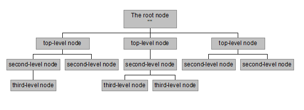
>
> Các nhãn được chia ra bởi dấu “.”. Tên miền là chuỗi các nhãn từ node
> đến gốc, đọc từ trái sang phải.
>
> 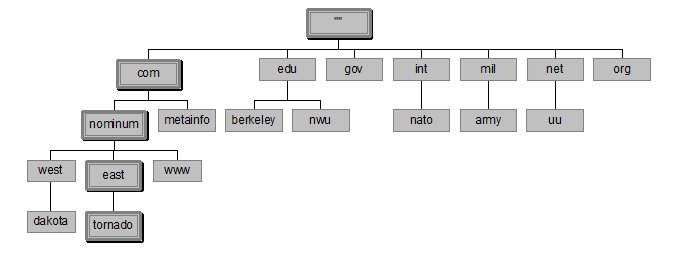

-   Gốc (Domain root):Nó là đỉnh của nhánh cây của tên miền. Nó xác định
    kết thúc của domain. Nó thể diễn đơn giản chỉ là dấu chấm “.”

-   Tên miền cấp một (Top-level-domain) : Các tên miền top-level gốc
    chia không gian tên miền internet thành 7 miền :

    -   Com : các tổ chức thương mại (commercial organizations )

    -   Edu : các tổ chức giáo dục

    -   Gov: các tổ chức chính phủ

    -   Mill: các tổ chức quân sự

    -   Net: trước đây là các tổ chức cung cấp hạ tậng mạng. kể từ năm
        1996, net được mở rộng với bất kì tổ chức thương mại nào.

    -   Org: giống net. Trước đây là tổ chức phi thương mại

    -   Int: tổ chức quốc tế.

-   Tên miền cấp nhỏ hơn (Subdomain): Chia thêm ra của tên miền cấp hai
    trở xuống thường được sử dụng như chi nhánh, phòng ban của một cơ
    quan hay chủ đề nào đó.Như phone.fpt.vn là một phòng của công
    ty Fpt. Một số chú ý khi đặt tên miền:

-   Tên miền nên đặt giới hạn từ cấp 3 đến cấp 4 vì nhiều hơn nữa việc
    nhớ tên và quản trị khó khăn.

-   Sử dụng tên miền la phải duy nhất trong mạng Internet.

-   Nên đặt tên đơn giản gợi nhớ và tránh.

> VD: Internet sử dụng một số domain để xác định các host; truy vấn cho
> tài nguyên địa chỉ trả về các địa chỉ host internet.

2.2. Server

Name server là các chương trình server lưu giữ thông tin cấu trúc tên
domain và tập các thông tin. Name server có thể lưu trữ cấu trúc hoặc
tập thông tin về bất cứ phần nào của cây domain (nhưng thông thường name
server có đầy đủ thông tin cụ thể về tập con của không gian domain) và
trỏ đến các name server khác mà có thể sử dụng để kết nối thông tin từ
bất cứ phần nào của cây domain. Các name server biết các phần của cây
domain mà đã hoàn thành thông tin; name server được cho là authority cho
những phần này của name space. Thông tin xác thực được tổ chức thành các
unit gọi là zone, những zone này có thể tự động phân phối đến các name
server được cung cấp dịch vụ dự phòng cho dữ liệu trong một zone.

Có 2 loại name server.

> - Authoritative server:

-   Primary server (master): nơi dữ liệu được điều chỉnh

    -   Nguồn xác định thông tin chính thức cho các domain mà nó được
        phép quản lí.

    -   Thông tin về tên miền do nó được phân cấp quản lý thì được lưu
        trữ tại đây và sau đó có thể được chuyển sang cho
        secondary server.

    -   Các tên miền do primary server quản lý thì được tạo và sửa đổi
        tại primary server và được cập nhật đến các slave server

    -   Primary server nên đặt gần với các client để có thể phục vụ truy
        vấn tên miền một cách dễ dàng và nhanh chóng hơn.

-   Secondary server (slave server)

    -   Dùng để lưu trữ dự phòng cho primary server nên là không bắt
        buộc phải có.

    -   Nó được phép quản lý những dữ liệu tên miền, nhưng không tạo ra
        các bản ghi về tiên miền mà lấy về từ master server.

    -   Khi lượng truy vấn zone tăng cao tại primary server thì nó sẽ
        chuyển bớt tải sang cho secondary server

    -   Khi master server bị gặp sự cố không hoạt động được thì
        secondary server sẽ hoạt động thay thế cho đến khi primary
        server hoạt động trở lại.

    -   Secondary server nên được đặt ở gần với primary server và client
        để phục vụ cho việc truy vấn dễ dàng hơn.

    -   Không nên cài đặt secondary server trên cùng một mạng
        con (subnet) hoặc cùng một kết nối với primary server, vì khi
        primary server có kết nói bị ảnh hoảng thì không ảnh hưởng
        đến nó.

    -   2 cơ chế cho phép lấy thông tin về các zone mới từ primary
        server

        - Caching (recursive server): không quản lý domain, chỉ phục vụ
        cho phép truy vấn tìm kiếm nhanh.

#### 2.2.1. .Các phương pháp đồng bộ dữ liệu giữa các DNS server

-   Để đảm bảo hoạt động ổn định, thì ta nên dùng trên 1 DNS server.

-   Do vậy ta phải có cơ chế chuyển dữ liệu các zone và đồng bộ giữa các
    DNS server \# nhau:

    -   Truyền toàn bộ zone(all zone transfer ): nhân toàn bộ dữ liệu từ
        primary server sang secondary server.

    -   Truyền phần thay đổi(Incremental zone): chỉ truyền những những
        dữ liệu thay đổi của zone .

-   Truyền zone xảy ra trong các trường hợp sau:

    -   Khi quá trình làm mới của zone kết thúc

    -   Khi secondary server được thông báo zone đã thay đổi tại server
        nguồn quản lý zone

    -   Khi dịch vụ DNS bắt đầu chạy lại secondary server

    -   Tại secondary server yêu cầu chuyển zone

        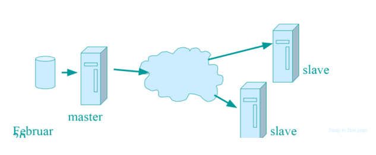

        2.3. Các resolver

        RESOLVERs là các chương trình trích xuất thông tin từ name
        server để đáp ứng yêu cầu từ client. Resolvers phải sẵn sàng
        truy cập vào ít nhất 1 name space và sử dụng thông tin thuộc
        name server đó để trả lời trực tiếp truy vấn, hoặc cố gắng truy
        vấn đến name server khác. Resolver là nhà cung cấp dịch
        vụ internet.

1.  Cách thức hoạt đông

    -   Hệ thống DNS hoạt động tại mức4 của mô hình OSI, nó sử dụng truy
        vấn bằng giao thức UDP, sử dụng cổng 53 để trao đổi thông tin.

    -   Các DNS server đều được kết nối logic với nhau, tất cả các DNS
        server phải biết ít nhất một cách đến root server, một máy tính
        kết nối mạng phải biết làm thế nào để liên lạc với ít nhất là
        một DNS server.

    -   Khi DNS client cần xác định cho một tên miền nó sẽ truy vấn DNS.

    -   Mỗi message truy vấn gồm 3 phần:

        -   Tên của miền cần truy vấn

        -   Xác định loại bản ghi(mail, web…)

        -   Lớp tên miền

    -   Khi DNS nhận được một truy vấn.Trước tiên nó sẽ kiểm tra thông
        tin có phải trong bản ghi nó đang quản lý không, nếu có sẽ trả
        lời và kết thúc.

    -   Nếu không có nó sẽ kiểm tra trong cache xem có truy vấn nào
        trước đây tương tự không nếu có sẽ trả lời và kết thúc.

    -   Nếu không có thông tin phù hợp nó sẽ nhờ tới DNS server khác để
        trả lời.

    -   VD

2.  Root server: là gốc của kiến trúc dns. Có tất cả 13 bộ khắp
    thế giới. Được chay bởi 12 tổ chức khác nhau. Mỗi bộ sỡ hữu địa chỉ
    ip riêng.

    TLD

    Authoritative name server: đảm nhận tất cả tên miền và địa chỉ ip.
    Là xác thực cuối.

    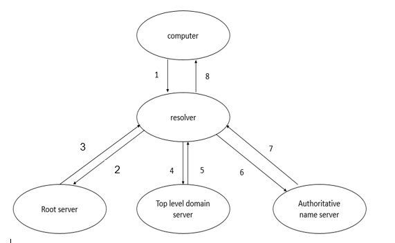

    B1: Khi gõ địa chỉ xxx.com trong web browser. Web browser hoặc hệ
    điều hành không tìm thấy đia chỉ ip trong bộ nhớ cache của nó, thì
    máy tính sẽ gửi truy vấn đến resolver server.

    B2. Resolver nhận được truy vấn thì kiểm tra bộ nhớ cache để tìm địa
    chỉ ip cho xxx.com, và nếu resolver server không tìm thấy địa chỉ ip
    cho xxx.com thì sẽ gửi truy vấn đến root server.

    B3. Root server nhận được tên miền và root server không biết tên
    miền đó là gì nhưng root server biết nơi mà resolver có thể hỏi. Sau
    đó, root server chuyển hướng trực tiếp resolver đến top-level domain
    server của tên miền .com

    B4. Resolver hỏi TLD về địa chỉ ip của xxx.com.

    B5. TLD nhận được truy vấn về địa chỉ ip của xxx.com và lưu trữ địa
    chỉ ip của tên miền xxx.com. Vì vậy, TLD sẽ chuyển hướng resolver
    đến authoritative name server.

    B6. Tiếp tục, resolver gửi truy vấn đến authoritative name server về
    địa chỉ ip của xxx.com.

    B7. Khi authoritative nhận được truy vấn sẽ trả lời về địa chỉ ip
    của xxx.com

    B8. Cuối cùng, resolver sẽ trả về cho computer địa chỉ ip của
    xxx.com và đồng thời sẽ lưu trữ địa chỉ ip của xxx.com vào bộ nhớ
    cache của nó. Và khi truy cập lại vào xxx.com thì không cần phải
    truy vấn nhiều bước như ban đầu.

<!-- -->

1.  Cấu trúc các bản lưu trữ tài nguyên

    DNS phân phối database lưu trữ trong dns records. DNS records bao
    gồm dữu liệu được yêu cầu bởi client. Phụ thuộc vào dạng của dns
    records, dns sẽ xác định dạng dữ liệu trả về dữ liệu cho client và
    client có thể làm được gì. Có rất nhiều dns records có thể được tạo.

    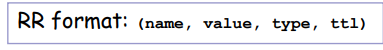

    Các loại lưu trữ tài nguyên DNS chủ yếu

| Type     | Nghĩa                                                           | Giá trị                         |
|----------|-----------------------------------------------------------------|---------------------------------|
| A / AAAA | Lưu trữ địa chỉ ip ánh xạ tên miền                              | A - Sử dụng cho IPv4            
                                                                                                               
                                                                              AAAA- Ipv6                       |
| CNAME    | Tạo ra một bản ghi thay thế hoặc biệt danh cho một bản ghi khác |                                 |
| MX       | Trao đổi mail                                                   | Ưu tiên, domail chấp nhân email |
|          |                                                                 |                                 |
| NS       | Name server                                                     | Tên của server cho domain       |
| PTR      | Con trỏ                                                         | Bí danh cho địa chỉ ip          |
| SRV      |                                                                 |                                 |

1.  CNAME record

    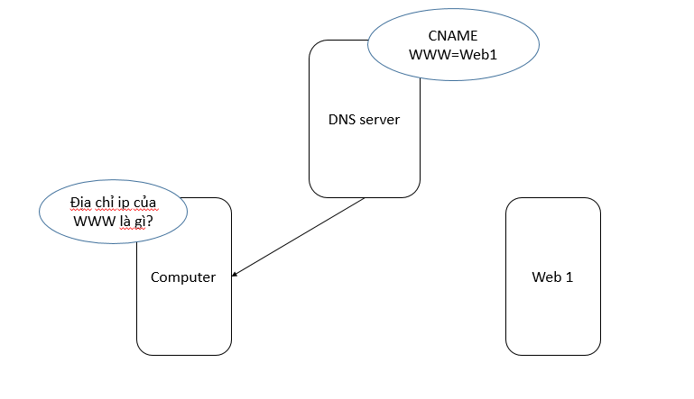

    Thay vì nhớ tên miền web1, người dùng có thể sử dụng bí danh của
    nó www. Bản ghi thay thế sẽ được tạo. Khi người dùng hỏi địa chỉ ip
    của www thì DNS sẽ trả về địa chỉ ip của web1.Có thể tạo được bản
    thay thế khác. Nhưng sẽ có phiền phức khi tạo ra 2 bản lưu như vậy.
    Khi địa chỉ ip của web1 thay đổi thì phải thay đổi 2 bản thay thế.

    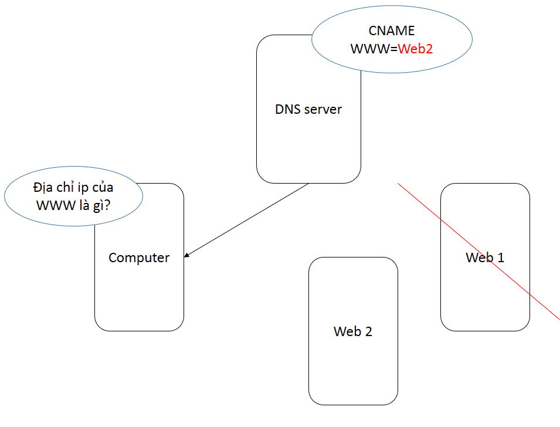

    Trong trường hợp có 2 server và server 1 bị reboot, thì cname có thể
    được thay đổi bất cứ lúc nào sang server 2. Bây giờ tất cả yêu cầu
    của người dùng với www sẽ trả về địa chỉ ip của web2.

2.  Trao đổi mail

    Định danh mail server cho dns name.Ví dụ: nếu một mail record được
    tạo cho xxx.com nó sẽ bao gồm mail server xử lý email cho xxx.com.
    Khi một mail server có email cần gửi, nó cần xác định mail server mà
    sẵn sàng chấp nhận mail cho tên miền xxx.com. Mail server gửi sẽ
    truy vấn đến dns server. Dns server sẽ trả lại cho mail server bản
    tin mx có chứa thông tin server nhận xử lý domain xxx.com.

    Mail exchange có nhiều bản cho cùng một dns name. DNS server sẽ chọn
    server xử lý mail có độ ưu tiên thấp nhất. Nếu cùng độ ưu tiên thì
    mx sẽ được chọn ngẫu nhiên. Nếu email gửi đến server có độ ưu tiên
    thấp bị lỗi thì Mx được gửi sẽ là độ ưu tiến tiếp theo đến cho
    mail server.

3.  Bản tin dịch vụ (SRV)

    Bản tin srv lưu trữ vị trí cụ thể của một dịch vụ cụ thể.

<!-- -->

1.  Cấu trúc gói tin Domain

    Trao đổi thông in giữa client/server trong DNS được tạo điều kiện
    bằng cách sử dụng truy vấn/phản hồi tin nhắn. Cả truy vấn lẫn câu
    trả lời có cùng một định dạng chung, chứa tới năm phần riêng mang
    thông tin. Trong số này, có hai trường thường được tìm thấy trong cả
    truy vấn và câu trả lời: phần Tiêu đề và phần Câu hỏi. Tôi sẽ bắt
    đầu khám phá các định dạng chi tiết của các thông điệp DNS bằng cách
    nhìn vào hai phần này; chủ đề tiếp theo sẽ bao gồm các định dạng bản
    ghi nguồn được các máy chủ sử dụng cho ba phần tin nhắn khác

    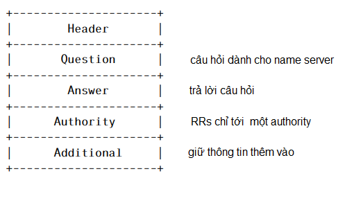

    Section header luôn luôn tồn tai. Header mô tả dạng gói tin, những
    trường được chưa bên trong gói tin và xác định khi nào thì gói tin
    là truy vấn hay phản hồi, …

    Section question bao gồm các trường mô tả câu hỏi tới name server. 3
    Section cuối có chung format. Section answer bao gồm rrs dùng để trả
    lời câu hỏi. authority bao gồm rrs chỉ ra name server xác thực.
    Section additional gồm rrs liên quan đến truy vấn (không phải là trả
    lời bắt buộc cho question)

3.1 Format header

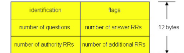

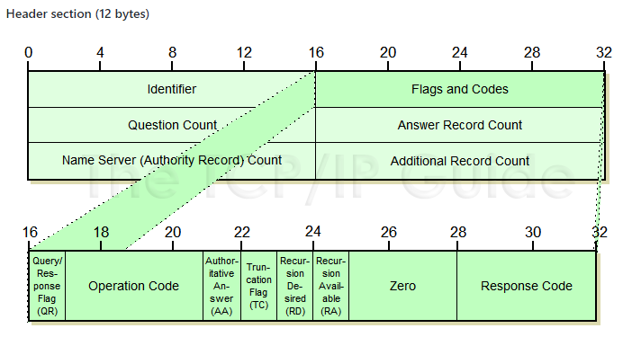

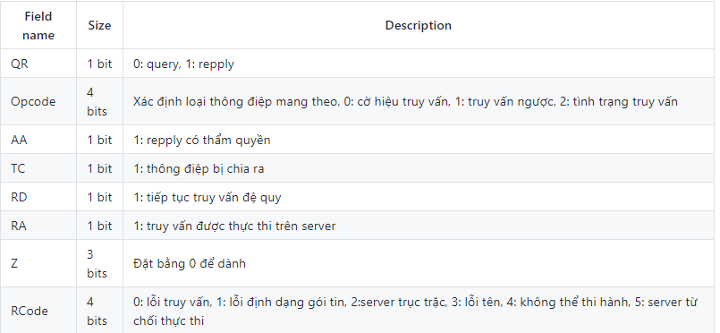

-   **identification** : số thứ tự (16 bit), nối giữa repply nhận được
    và queries gửi đi.

-   **number of questions** : số lần truy vấn của một gói tin trong một
    vấn đề

-   **number of answer RRs** : số tài nguyên tham gia trong phần trả lời

-   **number of authority RRs** : lượng tài nguyên được ghi lại trong
    phần có thẩm quyền của gói tin

-   **number of additional RRs** : lượng tài nguyên được ghi lại trong
    phần thêm vào của gói tin

-   Question section: Chứa thông tin về truy vấn được tạo ra, bao gồm
    tên và kiểu trường cho truy vấn.

-   Answers section: Chứa các Resource Record cho câu trả lời truy vấn.

-   Authority section: Chứa các bản ghi của server có thẩm quyền.

-   Additional section: Các thông tin mở rộng có thể được dùng.

